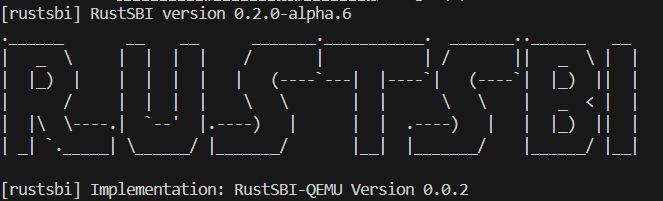
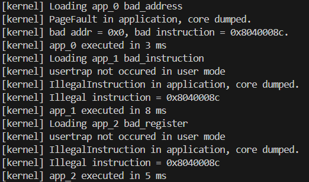

# 实验报告
## 1. 增加部分
- 继承 `ch2` 分支中对练习题的实现
- 设置用户栈大小为 4096 Bytes
- 为 `sys_write` 增加对地址空间的安全检查

## 2. 问答部分
- 1. sbi 版本与程序报错行为：
    
    

- 2. trap.S
    - 1. 刚进入 `__restore` 时，`a0` 代表内核栈中一个 Trap 上下文的栈顶。在内核启动后进入用户态和 Trap 处理完成后返回用户态时会使用 `__restore`. 

    - 2. 特殊处理了 `t0,t1,t2` 三个通用寄存器和 `sstatus,sepc,sscratch` 三个 CSR 寄存器。可以看到，三个通用寄存器作为中转分别从栈上恢复了此前 `__alltrap` 中存储的 `sstatus,sepc,sscratch` 三个字段。其中 `sstatus` 保存了中断的一些信息，`sepc` 为中断返回后的指令地址，`sscratch` 保存了用户栈地址。

    - 3. 我们需要 `sp(x2)` 来确定每个寄存器需要被保存到的正确位置，而 `tp(x4)` 除非出于一些特殊用途手动使用它，一般不会被用到。

    - 4. L63 的该指令交换了 `sp` 和 `sscratch` 的值，交换后 `sp` 指向用户栈顶，`sscratch` 指向内核栈顶。

    - 5. `sret`, 因为该指令会使 CPU 根据 `sstatus` 的 `SPP` 字段设置当前特权级，然后跳转到 `sepc` 指向的指令继续执行。

    - 6. L13 的该指令交换 `sp` 和 `sscratch` 的值，交换后 `sp` 指向内核栈顶，`sscratch` 指向用户栈顶。

    - 7. 从 U 态进入 S 态是系统调用指令 `ecall` 的作用。

- 3. 可以只保留可能会发生改变的寄存器。