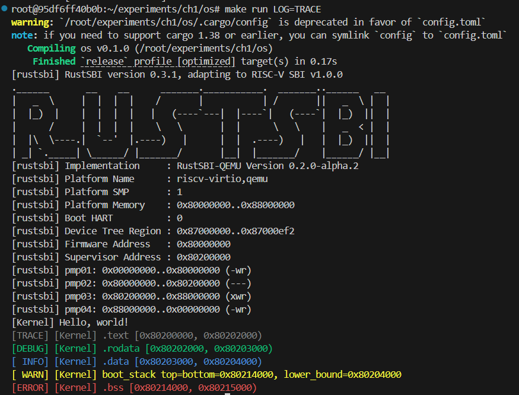

# ch1 实验文档
## 1. 编程内容
- Makefile, 支持 `make run LOG=XXX` 方式运行，支持 `make gdbclient/gdbserver` 方式进行调试
- 基于 Crate Log 的 Logging.rs, 实现了 SimpleLogger
- 修改 main.rs 借助 SimpleLogger 的功能完成级别控制的日志输出

## 2. 运行截图

## 3. 问答问题
- 机器加电后 PC 为 `0x1000`, 从固定位置 `0x1018` 取得跳转地址 `0x80000000` 后跳转到 BootLoader；
- 进行一次固定数值运算得到地址 `0x80002000`, 存放在寄存器 ra 中，BootLoader 进行一系列初始化工作后跳转到被加载到这个地址的内核。